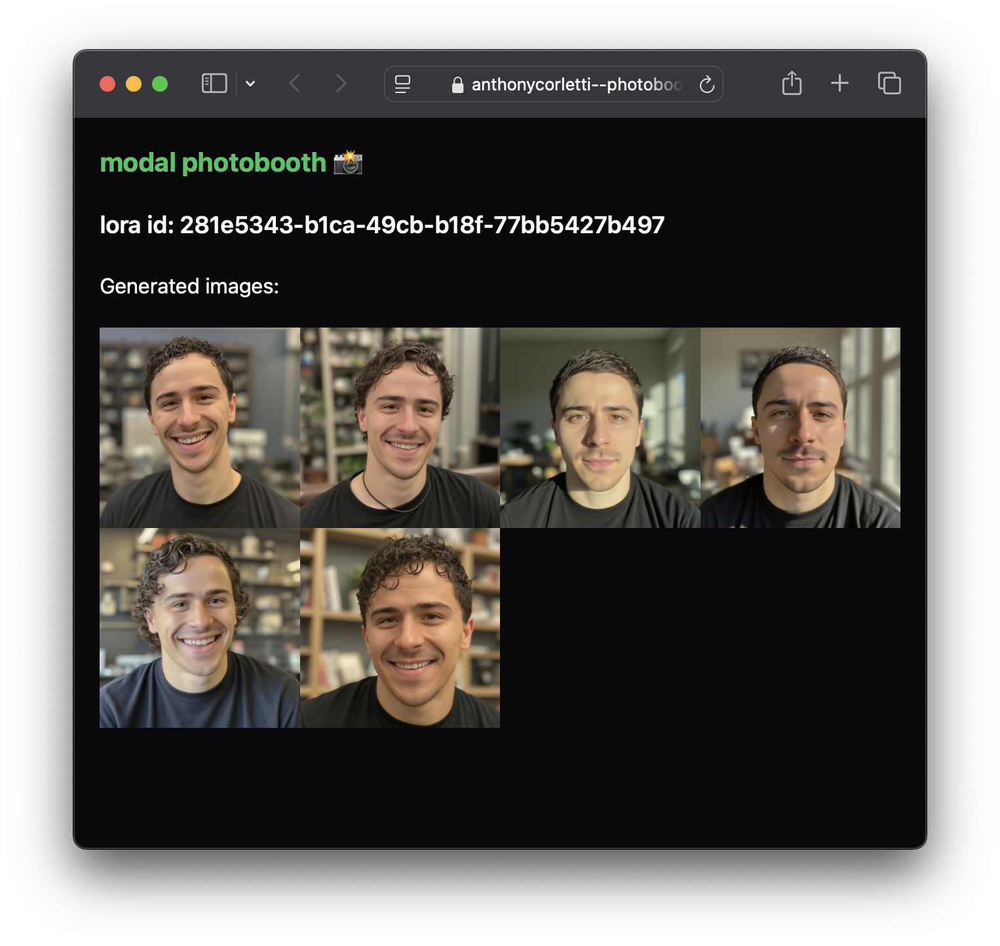

# modal-photobooth 📸

Create your own LoRA from a few photos with FLUX.1-dev, and use that LoRA to power your own AI photobooth for your LinkedIn photo, other profile pictures, your pets, impressing your in-laws, and more.

> [!NOTE]
> This is meant for demo and learning purposes. Your outputs may vary. Best to submit 8-12 consistent photos in size, with some variance in angles, backgrounds, and lighting - but nothing too extreme (tilted faces, many faces, too much contrast, etc.)



## Getting started

You'll need to install `uv` https://docs.astral.sh/uv/getting-started/installation/ and clone this repo.

After you've cloned, run `bin/install` to locally install the project.

You'll also have to agree to use the flux1-dev model terms: https://huggingface.co/black-forest-labs/FLUX.1-dev and generate a hugging face api key.

## Deploying to Modal

All code needed to create your infrastructure in Modal is located in `app/_modal.py`.

In order to deploy you'll need to:

1. Create an `.env.production` in the directory you cloned the project and set the following values

    ```
    APP_ENV=production
    APP_MODEL_DIR=/root/modal-photobooth-data/models
    APP_CONTENT_DIR=/root/modal-photobooth-data/content
    APP_SQLITE_PATH=/root/modal-photobooth-data/db.sqlite3
    APP_SECRET_KEY='your_key'
    APP_HF_TOKEN=your_token
    ```

1. Run `bin/deploy-modal`

> [!NOTE]
> Your first call might be super duper slow because you have to download flux. To do this before training your lora, simply open your app in the browser and check the logs before training: `https://YOUR_ORG_NAME--photobooth-server.modal.run/`

## Creating your LoRA

Create a `.zip` file of 8-12 photos of yourself and submit it to the `/lora` creation endpoint.

Set a subject name to be something unique and adjust the training prompt as you see fit.

```sh
curl -X 'POST' \
'https://YOUR_ORG_NAME--photobooth-server.modal.run/lora' \
-H 'accept: application/json' \
-H 'Content-Type: multipart/form-data' \
-F 'lora_create={"tuning_config":{"subject_name":"SUBJECT_NAME", "training_prompt": "A close-up photo of SUBJECT_NAME a person with distinct facial features, hair, and eyes."}}' \
-F 'content=@/Path/to/input.zip;type=application/zip'
```

Save the lora id in the output to pass to the generation call.

This may take around 30 minutes. If you want to retrain with different training parameters there's a `/lora/{lora_id}/retrain` endpoint you can use. See `app/photobooth/router.py::retrain_lora` for more details.

## Creating pictures with your LoRA

Now it's time to generate your photos!

```sh
curl -X 'POST' \
'https://YOUR_ORG_NAME--photobooth-server.modal.run/photobooth' \
-H 'accept: application/json' \
-H 'Content-Type: application/json' \
-d '{ "lora_id": "YOUR_LORA_ID", "prompt": "A professional photo of SUBJECT_NAME a 31 year old male founder wearing a black t-shirt in an office space looking at the camera.", "inference_config": {"num_inference_steps": 80, "num_images_per_prompt": 4} }'
```

Then go to `https://YOUR_ORG_NAME--photobooth-server.modal.run/` in your browser to view the generations. It should take about a minute or so.

## Future thoughts and considerations

- How the heck does https://fal.ai do lora training so fast https://fal.ai/models/fal-ai/flux-lora-fast-training/ (quality is variable)
- I'd love if Modal had an api for pre-signed urls for image retrieval

#### Credits:
- https://modal.com/docs/examples/diffusers_lora_finetune
- https://www.reddit.com/r/StableDiffusion/comments/1etszmo/finetuning_flux1dev_lora_on_yourself_lessons/
